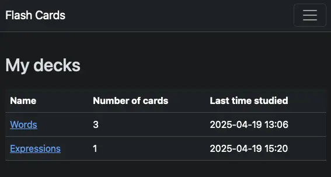
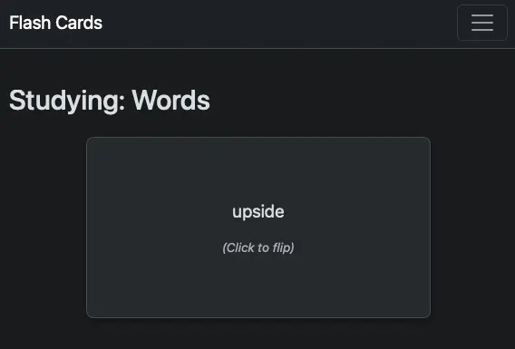
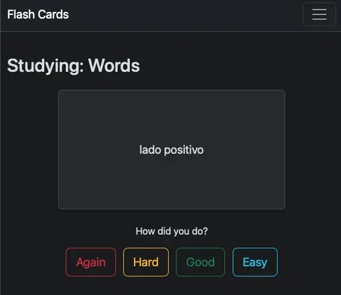

# Django Flash Cards

A simple flash card application built with Django to help with learning and memorization through spaced repetition.

## About

This project is a web-based flash card system that allows users to:
- Create and manage decks of flash cards
- Add cards with questions and answers
- Review cards using spaced repetition

## Why This Project?

I developed this project just to learn Python and Django. It is a simple application that demonstrates the use of Django for building web applications, and it can be extended with more features in the future.

## Screenshots

Here's a visual overview of the application:

### Decks List

*View your decks*

### Back side of a flash card

*Back side of the flash card, allowing us to click to flip*

### Front side of a flash card

*Front side of a flash card, showing the feedback options*

## Requirements

The following dependencies are needed:

- Python 3.11.4 (but should work with newer versions)
- Django 5.2

For development purposes, you need to install:

- Django Debug Toolbar
- Pytest
- Pylint
- Pylint Django
- Python Dotenv

## Installation

1. Clone the repository.

2. Navigate to the project directory:
```bash
cd django-flash-cards
```

3. Create and activate a virtual environment:
```bash
python -m venv .venv
source .venv/bin/activate  # works on unix environments
```

3. Install dependencies:
```bash
pip install -r requirements.txt

# Just for development
pip install -r requirements-dev.txt
```

4. Run migrations:
```bash
python manage.py migrate
```

5. Start the development server:
```bash
python manage.py runserver
```

6. Create `.env` file 
Configure the following variable to the `.env` file:
```.env
APP_TIME_ZONE=YOUT_TIMEZONE
```

Replace YOUR_TIMEZONE by your timezone. You can find a list of timezones [here](https://en.wikipedia.org/wiki/List_of_tz_database_time_zones). This configuration you display correctly the time in the application.

## Usage

1. Create an account or log in into Django Admin
```bash
# If you need to create a Django admin user
python manage.py createsuperuser
```
2. Create a new deck
3. Add cards to your deck
4. Start reviewing!
